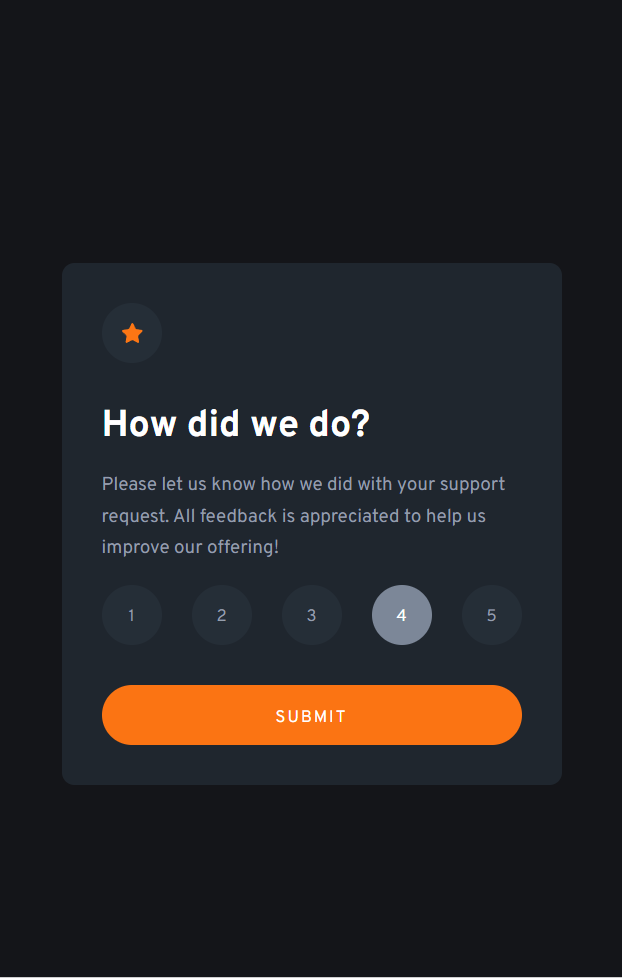
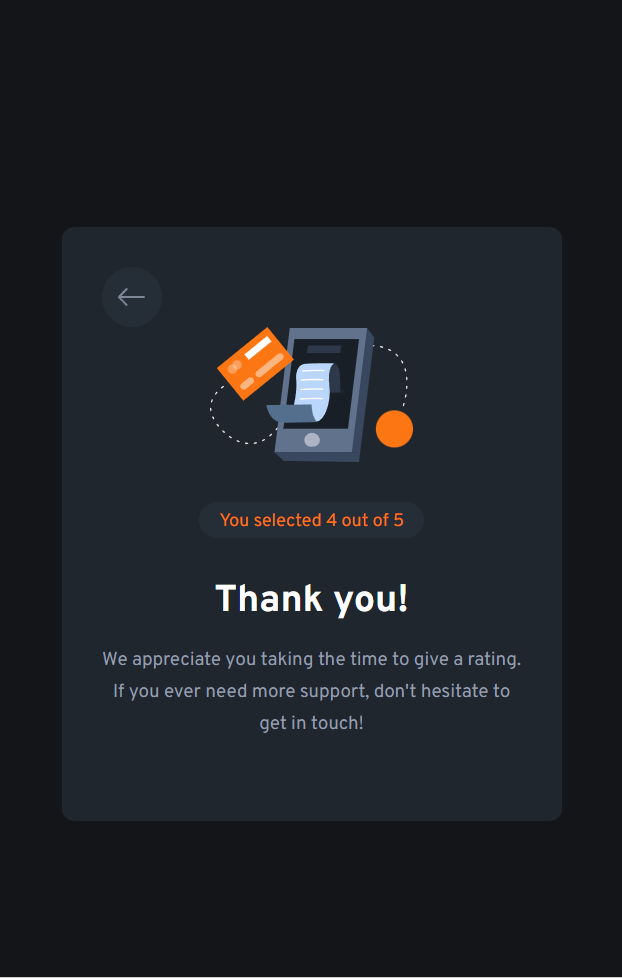

# Frontend Mentor - Interactive rating component solution

This is a solution to the [Interactive rating component challenge on Frontend Mentor](https://www.frontendmentor.io/challenges/interactive-rating-component-koxpeBUmI). Frontend Mentor challenges help you improve your coding skills by building realistic projects. 

## Table of contents

- [Overview](#overview)
  - [The challenge](#the-challenge)
  - [Screenshot](#screenshot)
  - [Links](#links)
- [My process](#my-process)
  - [Built with](#built-with)
  - [What I learned](#what-i-learned)
  - [Continued development](#continued-development)
  - [Useful resources](#useful-resources)
- [Acknowledgments](#acknowledgments)

## Overview

### The challenge

Users should be able to:

- View the optimal layout for the app depending on their device's screen size
- See hover states for all interactive elements on the page
- Select and submit a number rating
- See the "Thank you" card state after submitting a rating

### Screenshot




### Links

- Solution URL: [https://github.com/hg770/interactive-rating](https://github.com/hg770/interactive-rating)
- Live Site URL: [https://hg770.github.io](https://hg770.github.io/3-interactive-rating-component/rating.html)

## My process

### Built with

- Semantic HTML5 markup
- CSS custom properties
- Flexbox
- Mobile-first workflow
- JavaScript

### What I learned

Here I learned how to use the :hover, in order to show and hide elements:

```css
.thank-you button {
    margin-left: 0;
    border: none;
    background-color: hsl(210, 19%, 18%);
    width: 3rem;
    height: 3rem;
    border-radius: 50%;
    cursor: pointer;
}
.thank-you button .hvr-img {
    display: none;
}
.thank-you button:hover .hvr-img {
    display: inline-block;
}
.thank-you button:hover .btn-img {
    display: none;
}
.thank-you .btn-img, .hvr-img {
    padding: 0.7rem 0 0.6rem;
}

```
I learned how to use javascript and use eventListener:
```js
backButton.addEventListener("click", () => {
    thanksContainer.classList.add("hidden")
    mainContainer.style.display = "block"
})
rates.forEach((rate) => {
    rate.addEventListener("click", () => {
        rating.innerHTML = rate.innerHTML + " out of 5"
    })
})
```

### Continued development

I want to continue developing my javascript skills, by doing more interactive projects, and learning how to use it more. I also need to continue working on my css skills in order to gain in productivity and consistency.

### Useful resources

- [YouTube video by Tsb Sankara](https://www.youtube.com/watch?v=cQnUopEeZgw) - This helped me to understand a how to add interactiveness to a site, and use javascript along with css effectively.

## Acknowledgments

Tsb Sankara - 
https://www.youtube.com/watch?v=cQnUopEeZgw
